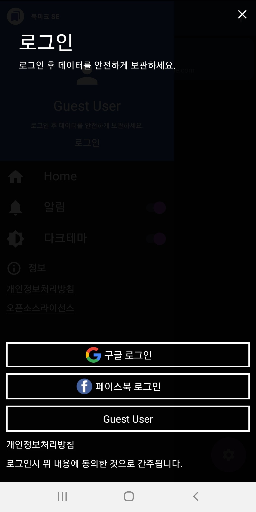
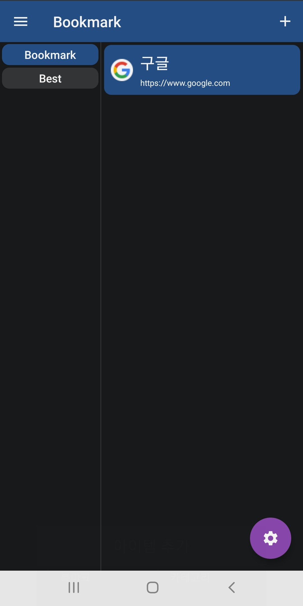
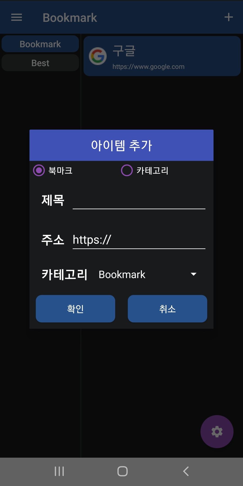
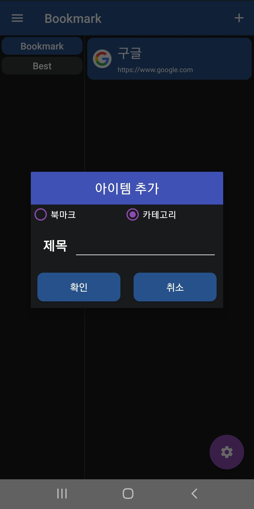

* * *
# PORTFOLIO 3 
## 북마크SE - 카테고리별로 북마크를 관리하는 앱 

[제작기간] 8주     
[프로젝트 내용] 카테고리별 북마크 관리    
[프로젝트 인원] 1명    

소스코드 : <https://github.com/ll0301/DotjariApp/tree/master/app/src/main>    
플레이 스토어 : 게시보류중
블로그 : <https://jroomstudio.tistory.com/>    
Email : <wanted0301@gmail.com>    
* * *
### SKILL
  > #### Android    
  >  * java    
  >  * MVVM Pattern
  >  * Livedata - Databinding
  >  * Room database 
  >  * Retrofit2
  >  * Google, Facebook login
  >  * Firebase fcm 
  >  ***
  > #### Linux Server
  >  * IWinV - Ubuntu 18.04 LTS(64bit)
  >  * Apache 2.4.29
  >  * PHP 7.2.25
  >  * MariaDB 10.1.44
  >  * HTTP 통신 
  >  * JWT 인증 
  >  * 회원관리 
  >  * JSON 데이터  
* * *
### 세부 기능
  >  * Google, Facebook 로그인 연동
  >  * Room database + SharedPreference 활용한 게스트 유저 데이터 CRUD 구현 
  >  * Firebase fcm 알림기능 
  >  * Drag & Drop으로 북마크 순서 조절 
  >  * 북마크 url 공유 
  >  * Dark Theme 구현 
  >  * Retrofit을 활용한 HTTP 통신 
  >  * JWT 인증을 통한 회원가입, 로그인
  >  * MariaDB 회원 데이터 테이블 관리 
  >  * PHP + JSON 데이터를 활용하여 회원 데이터 CRUD 구현   
  </img>
  </img>    
  </img>
  </img>
* * *
