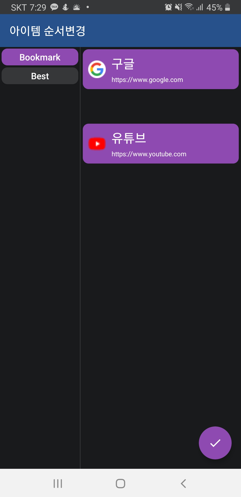
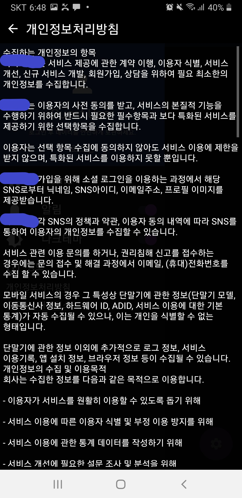

* * *
# PORTFOLIO 3 
## 북마크SE - 카테고리별로 북마크를 관리하는 앱 
>[제작기간] 8주     
>[프로젝트 내용] 카테고리별 북마크 관리    
>[프로젝트 인원] 1명    
>
>소스코드 :    
>Android <https://github.com/ll0301/BookmarkSE/tree/master/SmartBookmarkEditor/app/src/main>     
>PHP <https://github.com/ll0301/BookmarkSE/tree/master/Server_php>     
>플레이 스토어 : 게시보류중    
>블로그 : <https://jroomstudio.tistory.com/>    
>Email : <wanted0301@gmail.com> 
>
* * *
### SKILL
  > #### Android    
  >  * java    
  >  * MVVM Pattern
  >  * Livedata - Databinding
  >  * Room database 
  >  * Retrofit2
  >  * Google, Facebook login
  >  * Firebase fcm 
  >  ***
  > #### Linux Server
  >  * IWinV - Ubuntu 18.04 LTS(64bit)
  >  * Apache 2.4.29
  >  * PHP 7.2.25
  >  * MariaDB 10.1.44
  >  * HTTP 통신 
  >  * JWT 인증 
  >  * 회원관리 
  >  * JSON 데이터  
* * *
### 클래스 및 기능 설명
  > #### 메인 페이지
  > </img>
  > </img>
  > </img>  
  > ##### 클래스
  > </img>
  >
  >  * home 프래그먼트 에서 bookmark 및 category 아이템 Recycler View 구현
  >  * Navigation View와 메뉴 
  >  * push 알림 및 다크테마 스위치
  >  * home 프래그먼트와 Navigation View 에 각각 viewModel 생성하고 분리하여 MVVM 패턴 적용   
* * *
  > #### 아이템 추가,편집 팝업
  > </img>
  > </img>
  > </img>  
  > ##### 클래스
  > </img>
  >
  >  * category, bookmark 아이템 로컬데이터베이스(게스트), 원격데이터베이스(회원)에 각각 생성
  >  * 아이템 수정, 삭제
  >  * 북마크 공유기능 
  >  * 프래그먼트(view)와 viewModel클래스로 구분하여 MVVM 패턴 적용  
* * *
  > #### 아이템 추가,편집 팝업
  > </img>
  > </img>
  > </img>  
  > ##### 클래스
  > </img>
  >
  >  * category, bookmark 아이템 로컬데이터베이스(게스트), 원격데이터베이스(회원)에 각각 생성
  >  * 아이템 수정, 삭제
  >  * 북마크 공유기능 
  >  * 프래그먼트(view)와 viewModel클래스로 구분하여 MVVM 패턴 적용  
* * *
  > #### 아이템 포지션 편집 페이지 (Drag & Drop)
  > </img>
  > </img>
  > </img>  
  > ##### 클래스
  > </img>
  >
  >  * 프래그먼트에서 bookmark 및 category 아이템 Recycler View 구현
  >  * 각 아이템 Drag & Drop 으로 포지션 편집  
  >  * 프래그먼트(view)와 viewModel클래스로 구분하여 MVVM 패턴 적용  
* * *
  > #### 웹뷰 페이지 + 북마크 추가 팝업
  > </img>
  > </img>
  > </img>  
  > ##### 클래스
  > </img>
  >
  >  * url 검색 기능 
  >  * web-view로 인터넷 페이지 확인 
  >  * bookmark 추가 팝업으로 북마크 저장 
  >  * url 공유 기능 
* * *
  > #### 푸쉬알림 페이지 
  > </img>
  > </img>
  > </img>  
  > ##### 클래스
  > </img>
  >
  >  * 프래그먼트에서 Notice  Recycler View 구현 
  >  * Notice 객체 추가,수정,삭제
  >  * Firebase fcm 으로 푸쉬알림
  >  * 프래그먼트(view)와 viewModel클래스로 구분하여 MVVM 패턴 적용
* * *
  > #### 정보, 로그인 페이지 
  > </img>
  > </img>
  > ##### 클래스
  > </img>
  > </img>
  >
  >  * 개인정보 처리방침, 오픈소스 라이센스 안내문
  >  * 구글, 페이스북 로그인 구현 
  >  * Retrofit 과 jwt 인증을 통한 회원가입, 로그인 구현   
* * *
  > #### util 패키지 
  > ##### 클래스
  > </img>
  >
  >  * 개인정보 처리방침, 오픈소스 라이센스 안내문
  >  * 구글, 페이스북 로그인 구현 
  >  * Retrofit 과 jwt 인증을 통한 회원가입, 로그인 구현   
* * *
  > #### data 패키지 
  > ##### 클래스
  > </img>
  >
  >  * 개인정보 처리방침, 오픈소스 라이센스 안내문
  >  * 구글, 페이스북 로그인 구현 
  >  * Retrofit 과 jwt 인증을 통한 회원가입, 로그인 구현   
* * *
### Android MVVM Pattern
* * *                      
